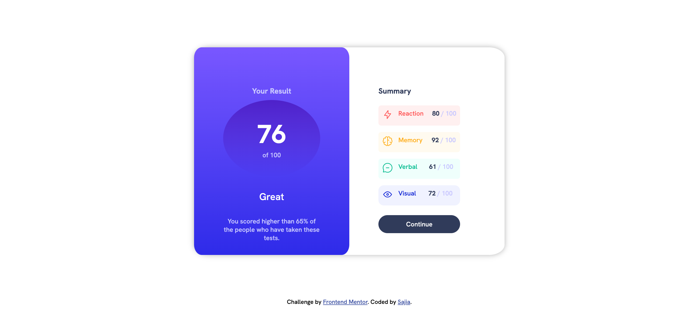

# Frontend Mentor - Results summary component solution

This is a solution to the [Results summary component challenge on Frontend Mentor](https://www.frontendmentor.io/challenges/results-summary-component-CE_K6s0maV). Frontend Mentor challenges help you improve your coding skills by building realistic projects. 

## Table of contents

- [Overview](#overview)
  - [The challenge](#the-challenge)
  - [Screenshot](#screenshot)
  - [Links](#links)
- [My process](#my-process)
  - [Built with](#built-with)
  - [What I learned](#what-i-learned)
  - [Continued development](#continued-development)
  - [Useful resources](#useful-resources)
- [Author](#author)


**Note: Delete this note and update the table of contents based on what sections you keep.**

## Overview

### The challenge

Users should be able to:

- View the optimal layout for the interface depending on their device's screen size
- See hover and focus states for all interactive elements on the page

### Screenshot



### Links

- Solution URL: [Code of my first attempt can be found here](https://github.com/sajia-h/results-summary.git)
- Live Site URL: [Here's how my first attempt looks](https://sajia-h.github.io/results-summary/)

## My process

### Built with

- Semantic HTML5 markup
- CSS custom properties
- Flexbox
- CSS Grid

### What I learned

I took part in this challenge to familiarise myself with the basics again and relearn a few things I had forgotten whilst taking a break.

I learned more about how to effectively utilise the ':root' pseudo-class selector to save time when declaring styles for certain elements on a webpage.

```css
:root {
  --lsblue: hsl(252, 100%, 67%);
  --lrblue: hsl(241, 81%, 54%);
  --viblue: hsla(256, 72%, 46%, 1);
}
```

### Continued development

Areas that I want to continue focusing on in future projects includ:

- Mobile-first workflow
- [React](https://reactjs.org/) - JS library
- [Next.js](https://nextjs.org/) - React framework

### Useful resources

- 

## Author

- Website - [Sajia](Coming soon)
- Frontend Mentor - [@sajia-h](https://www.frontendmentor.io/profile/sajia-h)
